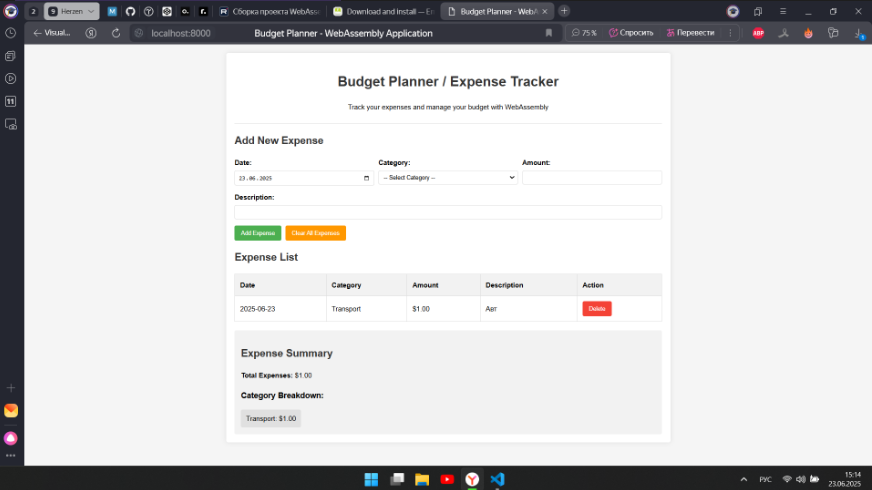
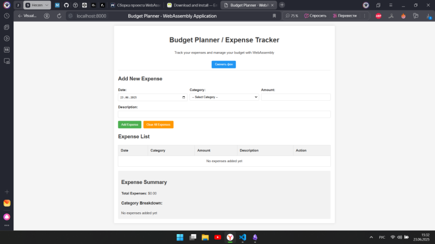

### Задание
```
Задание - доделать проект по WebAssembly - budget_planner_project.zip

Изучить файл README.md внутри проекта и сделать первичное изучение кода самого проекта, понять общих принцип работы кода.
Скачать и установить компилятор для WebAssembly с сайта https://emscripten.org (см. README.md).
Добиться компиляции и работы самого приложения.
Самостоятельно придумать какое-либо улучшение (improvment) для проекта, основываясь на исходных примерах кода в проекте.
 Сделать отчёт о проделано работе в формате Markdown.
Закомитить всё в один репозиторий на GitHub и прислать ответ в виде ссылке на него.
```

### Ход выполнения
P.S. в данном репозитории отсутствует директория EMSDK её требуется установить отдельно.
1. Был скачен архив с начальным проектом.
2. В данный проект был добавлен EMSDK по ссылке </br>
[https://emscripten.org/docs/getting_started/downloads.html](https://emscripten.org/docs/getting_started/downloads.html)
3. Были выполнены следующие команды в WSL
```bash
git clone https://github.com/emscripten-core/emsdk.git

cd emsdk

./emsdk install latest

./emsdk activate latest

source ./emsdk_env.sh

cd ..

emcc main.c -o index.js -s WASM=1 -O2 -s EXPORTED_RUNTIME_METHODS='["stringToUTF8","UTF8ToString"]' -s EXPORTED_FUNCTIONS='["_main","_jsAddExpense","_jsDeleteExpense","_jsClearAllExpenses","_jsGetTotalExpenses","_jsGetExpenseCount","_jsGetCategoryCount","_getExpenseJSON","_getCategoryTotalJSON","_freeMemory","_malloc","_free"]' --shell-file index.html -s ALLOW_MEMORY_GROWTH=1
```
4. После данных действий появятся файлы index.js и index.wasm
5. В файле index.html перед подключением app.js подключить index.js. </br>
Получится следующее:
```html
<script src="index.js"></script>
<script src="app.js"></script>
```
6. После этого можно запустить проект `python3 -m http.server 8000`. </br>
Проект будет доступен по ссылке `http://localhost:8000/`
7. Дополнительно добавлена кнопка смены цвета фона.

